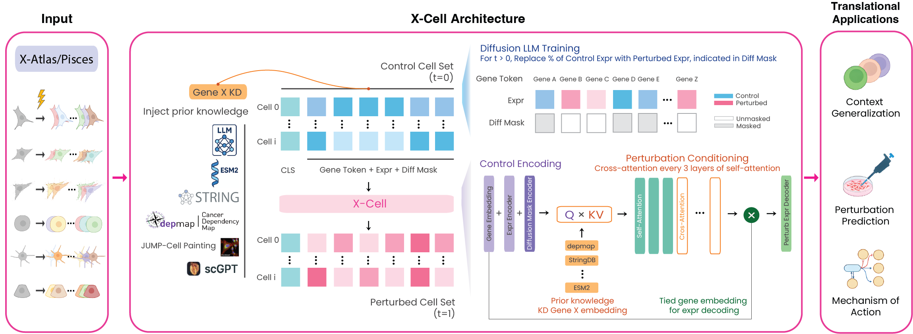

<p align="center">
  <h1 align="center">X-Cell</h1>
  <p align="center">
    <b>A diffusion language model for genome-scale perturbation prediction across diverse cellular contexts</b>
  </p>
</p>

<p align="center">
  <a href="https://creativecommons.org/licenses/by-nc-sa/4.0/"></a>
  <a href="https://huggingface.co/Xaira-Therapeutics/X-Cell"></a>
  <a href="https://huggingface.co/datasets/Xaira-Therapeutics/X-Atlas-Pisces"></a>
  <a href="#"></a>
  <a href="https://xaira-therapeutics.github.io/X-Cell"></a>
</p>

---

> **Status: Model weights and inference code coming soon.**
> The Python API, model weights, and tutorials are under active development.
> Star/watch this repository for release updates.

<p align="center">
  
</p>

X-Cell predicts genome-scale transcriptional responses to genetic perturbations across diverse cellular contexts. Trained on **X-Atlas/Pisces** (25.6M perturbed single cells, 7 CRISPRi Perturb-seq screens), X-Cell integrates multi-modal biological priors through cross-attention and generalizes zero-shot to unseen cell types and perturbations.

## Highlights

- **Diffusion LM** with iterative inference-time refinement
- **Multi-modal priors** via cross-attention (ESM-2, STRING, GenePT, DepMap, JUMP-Cell Painting, scGPT)
- **X-Cell Mini** (55M) — a compact model for single-GPU perturbation prediction
- **5× higher Pearson Δ** than the next-best method on held-out perturbations
- **Zero-shot generalization** to unseen cell types, confirmed on primary human T cells and melanocyte progenitors

## Installation

```bash
pip install xcell
```

## Quick Start

```python
import anndata as ad
from xcell import XCell

# Load pretrained X-Cell Mini
model = XCell.from_pretrained("Xaira-Therapeutics/X-Cell", variant="mini")

# Predict from an AnnData object
adata = ad.read_h5ad("control_cells.h5ad")
predictions = model.predict(adata, perturbation="BRCA1")

# Or from one or more .h5ad paths
predictions = model.predict(
    ["screen1.h5ad", "screen2.h5ad"],
    perturbation="BRCA1",
)
```

See the [documentation](https://xaira-therapeutics.github.io/X-Cell) for full examples.

## License

This project is licensed under the [Creative Commons Attribution-NonCommercial-ShareAlike 4.0 International License](https://creativecommons.org/licenses/by-nc-sa/4.0/).

## Model

| Model | Parameters | HuggingFace |
|-------|-----------|-------------|
| X-Cell Mini | 55M | [Xaira-Therapeutics/X-Cell](https://huggingface.co/Xaira-Therapeutics/X-Cell) |

## Data

**X-Atlas/Pisces** is available at [Xaira-Therapeutics/X-Atlas-Pisces](https://huggingface.co/datasets/Xaira-Therapeutics/X-Atlas-Pisces).

## Citation

```bibtex
@article{xcell2026,
  title   = {X-Cell: Scaling Causal Perturbation Prediction Across Diverse
             Cellular Contexts via Diffusion Language Models},
  author  = {{Xaira Therapeutics}},
  year    = {2026},
}
```

See [LICENSE](LICENSE) for details.
